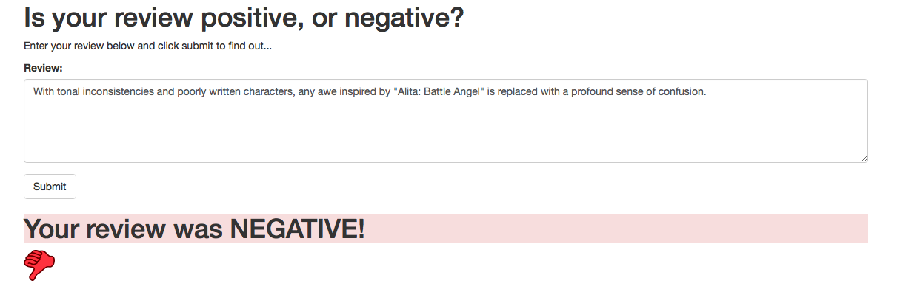

# Deploying a Sentiment Analysis Model
Deep Learning Nanodegree Project 5

 ## Project description
 In this project, we'll construct a recurrent neural network for the purpose of determining the sentiment of a movie review using the IMDB data set. We'll create this model using Amazon's SageMaker service. In addition, we'll deploy our model and construct a simple web app which will interact with the deployed model.

## Sample Negative Response
 

## Sample Positive Response
 

